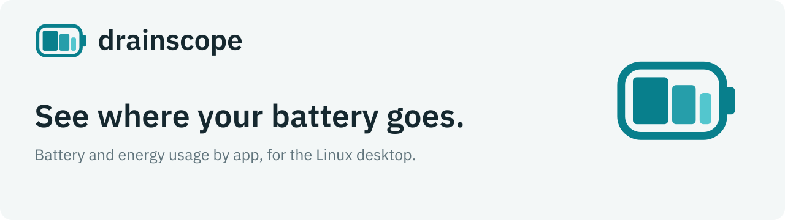
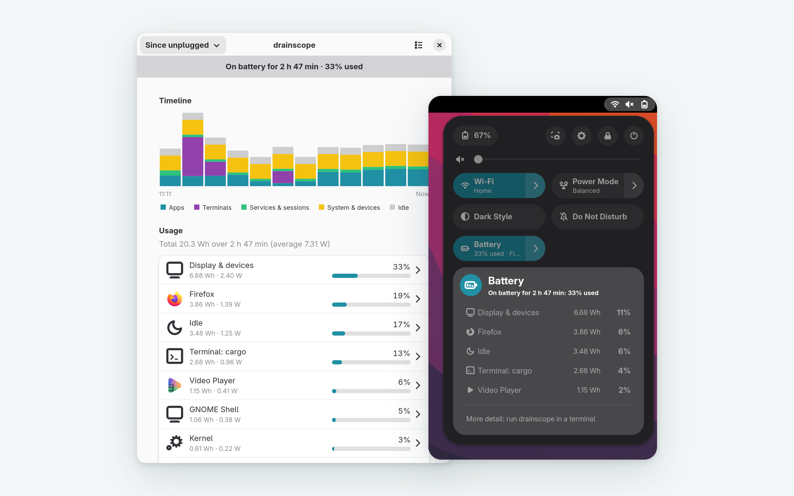

> "Firefox used 14% of your battery since you unplugged."
> Windows, macOS and Android have had this for years. Linux hasn't.

drainscope measures energy from hardware counters (RAPL via powercap) and the battery. It attributes that energy to apps, terminal workloads and system services through cgroup v2, DRM fdinfo and systemd scopes, keeps local history, and shows it in GNOME's quick settings and on the command line. No component runs as root.

**Status:** v0.1.4 is [released](https://github.com/KhaledSaeed18/drainscope/releases/tag/v0.1.4). It includes the daemon, the sandboxed sampler and eBPF probe with SELinux policy, the CLI, the GNOME Shell extension and the desktop app. Packages for Fedora 44, 45 and rawhide are in [COPR](https://copr.fedorainfracloud.org/coprs/khaledsaeed18/drainscope/); the extension is [on extensions.gnome.org](https://extensions.gnome.org/extension/11189/drainscope/), in review. What's done and what's next: [ROADMAP.md](ROADMAP.md). Architecture and privilege model: [PLAN.md](PLAN.md). Measurements on real hardware: [ADR 0001](docs/adr/0001-feasibility.md), [docs/validation.md](docs/validation.md) and [docs/validation-activity.md](docs/validation-activity.md).

## What it looks like

<picture>
  <source media="(prefers-color-scheme: dark)" srcset="branding/screenshots/exports/hero-dark.png">
  
</picture>

The desktop app and the GNOME Shell extension (illustrative data; more views in [branding/screenshots](branding/screenshots/README.md)). On the command line, illustrative output (not a measurement):

```console
$ drainscope
On battery for 1 h 12 min: 18% of the battery used.

Consumer                 Battery  Of active use    Energy
──────────────────────────────────────────────────────────
Display & devices            11%              —   4.62 Wh
Idle                          4%              —   1.71 Wh
Firefox                       2%            61%   0.84 Wh
Terminal: pnpm               <1%            17%   0.23 Wh
GNOME Shell                  <1%             9%   0.12 Wh
…
```

- `drainscope` — battery used since unplugged, by consumer
- `drainscope report --since 24h [--by kind] [--source battery|ac]` — energy over a period, with each app's share while in use and in the background (needs the GNOME Shell extension)
- `drainscope top` — live power per consumer
- `drainscope sleep` — battery lost while suspended, and what woke the machine
- `drainscope wakeups` — which apps keep waking the processor from idle (needs the optional eBPF probe)
- `drainscope network` — network traffic by app, excluding loopback (needs the optional eBPF probe)
- `drainscope health` — battery wear: full-charge capacity against design, and charge cycles
- `drainscope status` / `drainscope doctor` — what's measurable, and what to fix if something isn't

Add `--format json` or `--format csv` to `drainscope`, `report`, `sleep`, `health`, `wakeups` or `network` to export every row in joules, watts and Unix seconds, e.g. `drainscope report --since 7d --format csv > week.csv`.

The desktop app (`drainscope-app`) shows the same history with a stacked timeline (since unplugged, last hour, 24 h, 7 days), a breakdown per consumer (for apps, how much was used while in use and in the background), and battery lost in each suspend.

## Hardware support

| | Status |
|---|---|
| Intel laptops (RAPL `package`, `core`, `uncore`, `dram`) with i915 | Developed and validated here ([docs/validation.md](docs/validation.md)) |
| AMD Zen laptops (RAPL `package`, `core`) with amdgpu | Expected to work; integrated-GPU energy is split by CPU time ([ADR 0005](docs/adr/0005-amd-and-other-gpus.md)). Not yet tested on real hardware. |
| Intel xe driver (Lunar Lake and newer) | Works, but per-app GPU energy isn't split yet (ADR 0005) |
| No RAPL (VMs, some ARM) | Battery readings split by CPU time |

`drainscope doctor` reports which case applies to your machine.

## How it works

| Part | Runs as | Does |
|---|---|---|
| `drainscope-sampler` | dedicated system user with only `CAP_DAC_READ_SEARCH`, sandboxed (`systemd-analyze security`: 0.6) | Reads the root-only RAPL counters and serves them on the system bus to callers polkit allows (the active local session only), rate-limited per user and quantized against the Platypus side channel. Starts on demand, exits when idle. |
| `drainscope-probe` (optional) | dedicated system user with only `CAP_BPF`, `CAP_PERFMON` and `CAP_NET_ADMIN` (in an empty network namespace), sandboxed the same way (0.7) | Counts with eBPF how often each cgroup wakes a CPU from idle (`sched_switch`) and the bytes each one sends and receives (`cgroup_skb` on the root cgroup, alongside other programs), and serves per-cgroup totals to the active session. Other users' cgroups are never included, and no addresses or contents are seen ([ADR 0006](docs/adr/0006-ebpf-probe-service.md)). Starts on demand, exits when idle. |
| `drainscope-daemon` | you, as a `systemd --user` service | Every 5 s: reads cgroup CPU time, GPU time from DRM fdinfo, batteries and RAPL; attributes energy above the machine's learned idle floor to whoever was active; reconciles with the battery over 10 s windows; stores history in `~/.local/state/drainscope/` (one daemon per database, enforced with a lock file); serves `Monitor1` on the session bus. |
| `drainscope` | you | Reads `Monitor1`. |

Everything stays on your machine; no component uses the network. With the GNOME Shell extension, the daemon also records which app had focus, to split each app's energy into while in use and in the background: only the app's ID (never window titles), kept and pruned with the rest of the history.

## Installing (Fedora, COPR)

```bash
sudo dnf copr enable khaledsaeed18/drainscope
sudo dnf install drainscope drainscope-sampler drainscope-probe drainscope-app gnome-shell-extension-drainscope
systemctl --user enable --now drainscope.service
drainscope doctor
```

The packages are signed with the COPR project's key, which `dnf` imports on first install. Updates arrive through `dnf upgrade`.

## Installing from the release

Prefer COPR above (signed packages, updates). To install without it, download the Fedora 44 RPMs from the [v0.1.4 release](https://github.com/KhaledSaeed18/drainscope/releases/tag/v0.1.4), then:

```bash
sudo dnf install ./drainscope-0.1.4-1.fc44.x86_64.rpm ./drainscope-sampler-0.1.4-1.fc44.x86_64.rpm \
  ./drainscope-probe-0.1.4-1.fc44.x86_64.rpm ./drainscope-selinux-0.1.4-1.fc44.noarch.rpm \
  ./drainscope-app-0.1.4-1.fc44.noarch.rpm ./gnome-shell-extension-drainscope-0.1.4-1.fc44.noarch.rpm
systemctl --user enable --now drainscope.service
drainscope doctor
```

The sampler and the probe are optional: without them drainscope falls back to battery-only measurement and shows no wakeup or network data. Log out and back in to load the GNOME Shell extension, then enable it with `gnome-extensions enable drainscope@khaledsaeed18.github.io`.

## Installing (development)

Requirements: Fedora 44 (or another systemd + cgroup v2 distro with polkit), Rust stable, gcc, and clang with libbpf-devel for the probe. Don't combine this with the COPR packages: `install-dev` puts units in `/etc`, which override the packaged ones. Run `uninstall-dev` first to go back.

```bash
cargo build --release -p drainscope-sampler -p drainscope-probe -p drainscope-daemon -p drainscope-cli -p xtask
sudo target/release/xtask install-dev        # installs to /usr/local and /etc only
systemctl --user daemon-reload
systemctl --user enable --now drainscope.service
drainscope doctor
```

With `selinux-policy-devel` installed, `install-dev` also loads the SELinux modules that confine the sampler and the probe to their own domains (packaged as `drainscope-selinux`).

The GNOME Shell extension (log out and back in afterwards; Wayland loads extensions at login):

```bash
cd ui && pnpm install && pnpm --filter @drainscope/extension install-dev
gnome-extensions enable drainscope@khaledsaeed18.github.io
```

The desktop app (installs to `~/.local`):

```bash
cd ui && pnpm --filter @drainscope/app install-dev
```

Remove with `sudo target/release/xtask uninstall-dev` (and `systemctl --user disable --now drainscope.service`).

## Developing

```bash
cargo test --workspace                          # includes replays of recorded hardware traces
cargo xtask validate                            # accuracy harness; run unplugged
cd ui && pnpm install && pnpm typecheck && pnpm lint && pnpm test
```

Conventions are in [CLAUDE.md](CLAUDE.md); decisions in [docs/adr/](docs/adr/). Logos, icons, colors and usage rules: [branding/](branding/README.md).

## License

[GPL-3.0-or-later](LICENSE)
